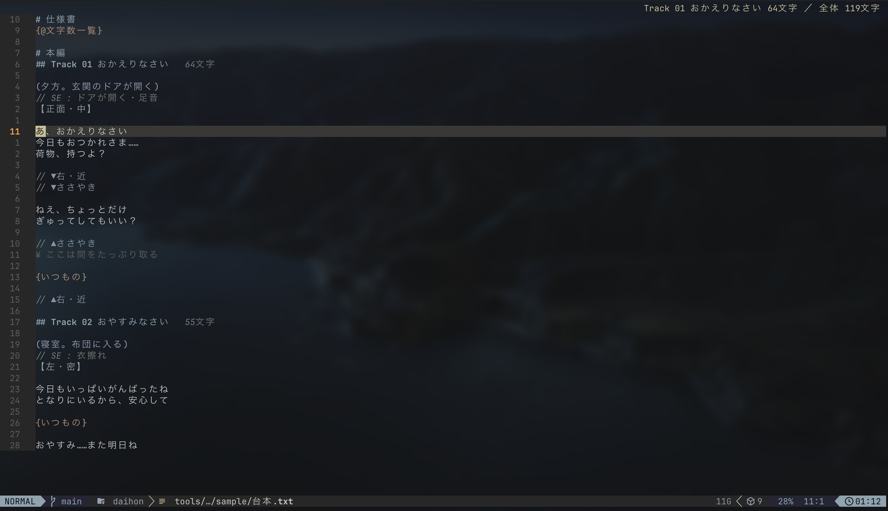
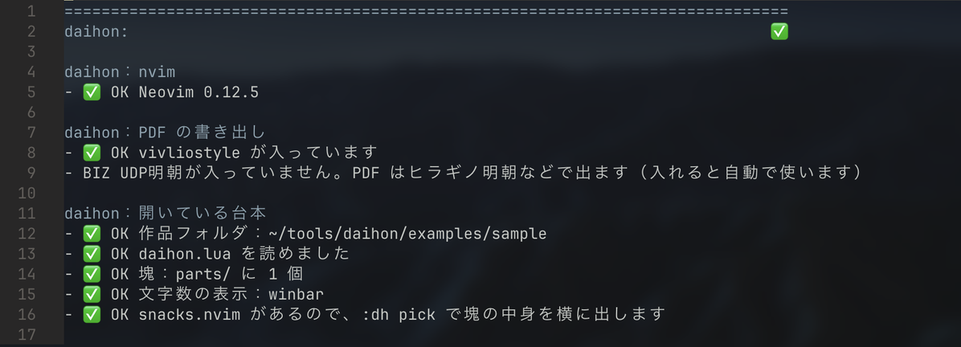
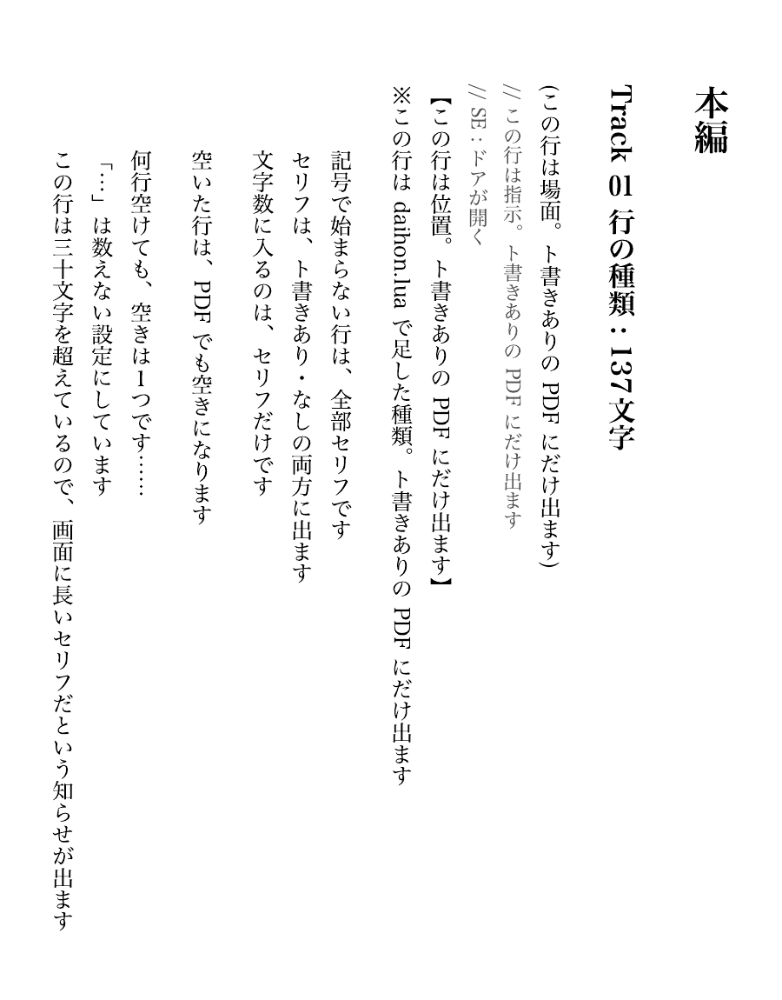
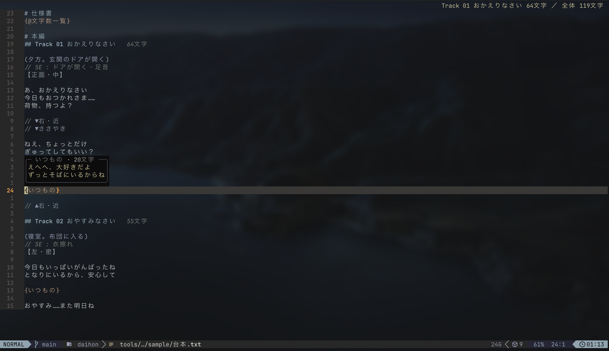

# daihon

[](https://github.com/komuggi/daihon/actions/workflows/test.yml)

音声作品の台本を nvim で書いて、縦書きの PDF にするプラグインです。



- **セリフとト書きを色で分ける**：行の頭の記号（`//` `(` `【` `¥`）で見分けます。記号は自分で決められます
- **文字数がいつも見える**：カーソルのあるトラックと全体の文字数を、右上に出します。ト書きは数えません
- **縦書き PDF をすぐ作れる**：`:dh pdf` で、ト書きあり／なしの2つを作ります

## はじめての設定

Neovim 0.10 以上で動きます。

**1. PDF を作る道具を入れる**（PDF を作るときだけ）

ターミナルで次を打ちます。

```sh
npm install -g @vivliostyle/cli
```

**2. nvim に daihon を入れる**

[lazy.nvim](https://github.com/folke/lazy.nvim)（LazyVim も同じ）なら、`~/.config/nvim/lua/plugins/daihon.lua` というファイルを作って、次を書きます。

```lua
return {
  { "komuggi/daihon", version = "*", opts = {} },
}
```

`version = "*"` があると、リリースした版（v0.1.0 など）だけを受け取ります。開発中の最新を使いたいときは外します。

**3. 確かめる**

nvim を開き直して `:checkhealth daihon` を打ちます。✅ が並べば準備できています。



## 使い方

1. 作品のフォルダに `daihon.lua` というファイルを置きます。中身は `return {}` の1行だけでかまいません
2. 同じフォルダに `.txt` を作って、台本を書きます
3. `:dh pdf` を打つと、`out/` に縦書きの PDF ができます



`daihon.lua` があるフォルダの `.txt` だけが台本になります。ほかのメモには反応しません。

### 台本の書き方

```text
# 本編
## Track 01 おかえりなさい

(夕方。玄関のドアが開く)
// SE : ドアが開く・足音
【正面・中】

あ、おかえりなさい
今日もおつかれさま……

// ▼右・近
ねえ、ちょっとだけ
// ▲右・近
¥ ここは間をたっぷり取る
{いつもの}
```

| 行の頭 | 種類 | PDF | 文字数 |
|---|---|---|---|
| なし | セリフ | 出す | 数える |
| `//` | 指示（`▼` `▲` で範囲を囲める。ラベルは候補から選べる） | 出す | 数えない |
| `(` | 場面 | 出す | 数えない |
| `【` | 位置 | 出す | 数えない |
| `¥` | メモ | 出さない | 数えない |
| `#` `##` | 見出し | 出す | `##` ごとに数える |

`{いつもの}` は、よく使う文章の塊です。中身は `parts/いつもの.txt` に書いておき、PDF では中身に置き換わります。上で `K` を押すと中身が見えます。



`// SE : ` と打つと、登録した SE とこの台本で使った SE が候補に出るので、書き方の揺れがそろいます。

ほかのコマンドは `:dh count`（文字数の一覧）、`:dh pick`（塊を選んで差し込む）、`:dh toggle`（塊を開く／閉じる）です。動く例は [examples/sample](examples/sample) にあります。

## もっと詳しく

設定・塊・書き出しの見た目は、nvim で `:h daihon` を見てください。

作品フォルダの `daihon.lua` は、nvim の機能やファイルに触れない環境で読みます。人からもらった作品フォルダを開いても、設定ファイルが何かを実行することはありません。

## ライセンス

MIT
